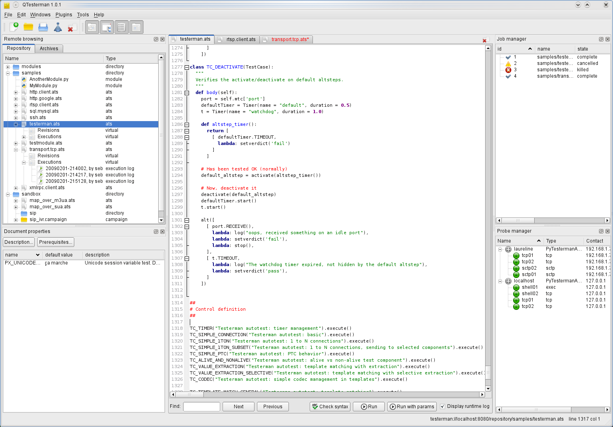
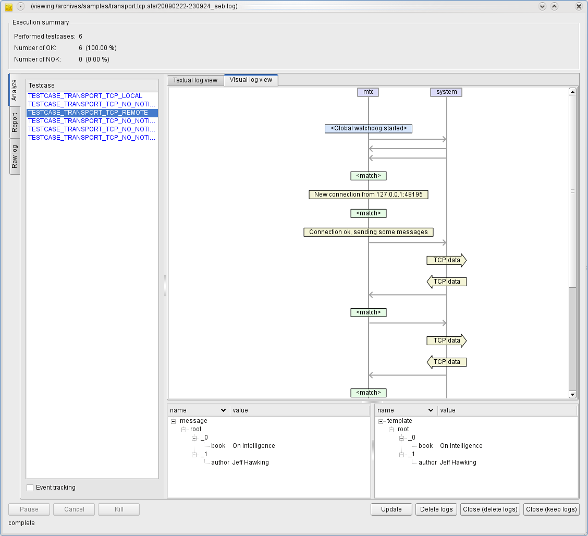

QTesterman
==========

QTesterman is the preferred client to execute Testerman scripts, monitor
and analyze their executions.

It is a cross-platform application (Windows, Unixes, Mac OS X) developed
in Python with PyQt4. This is the main interface to a Testerman system
most end-users will use.

Installation
------------

QTesterman basically requires Python 2.x >= 2.4.4, and a PyQt4 4.x >=
4.4.2. You may install them the way you are used to, from sources, or
following the instructions below. Please notice that actual package
versions may evolve and the ones given here may be deprecated or no
longer available as a direct link - in this case, just use the next or
recommended version on the associated sites.

Installing Prerequisites
~~~~~~~~~~~~~~~~~~~~~~~~

This section describes how you may install QTesterman dependencies on
several operating systems.

If you already installed them, you may jump to the
[#RunningtheQTestermanInstaller QTesterman installer execution].

Windows
^^^^^^^

To run QTesterman under Windows, you'll first need to install Python 2.x
and the PyQt4 library. QTesterman is not compatible with Python 3 for
now.

If you don't have any Python installation yet, you are advised to
install Python 2.6.1(or latest 2.6.x version) that you can grab from the
`official Python site <http://www.python.org/download/>`__ (`direct
Windows Installer link for Python
2.6.5 <http://www.python.org/ftp/python/2.6.5/python-2.6.5.msi>`__).
Once downloaded, simply run it and install the usual way.

Then, get PyQt4 from `Riverbank Computing
site <http://www.riverbankcomputing.co.uk/software/pyqt/download>`__.
You should get the Windows installer package that matches your Python
version, for instance
`PyQt-Py2.6-gpl-4.7.7-1.exe <http://www.riverbankcomputing.co.uk/static/Downloads/PyQt4/PyQt-Py2.6-gpl-4.7.7-1.exe>`__
if you installed a Python 2.6.x.
The binary PyQt4 package contains everything needed for QTesterman, in
particular the QScintilla2 module. When installing the package, you can
limit your installation options to the single "Qt libraries" option,
discarding all development tools, documentation, and examples.

Once these dependencies have been installed, you can proceed with the
[#RunningtheQTestermanInstaller QTesterman installer execution].

QTesterman has been tested on the following combinations:

-  Windows XP SP2 with Python 2.5.4 + PyQt 4.4.3
-  Windows Vista SP1 with Python 2.5.4 + PyQt 4.4.3
-  Windows 7 with Python 2.6.1 + PyQt 4.4.4

Debian-based Distributions
^^^^^^^^^^^^^^^^^^^^^^^^^^

Under Debian and derivatives, you should apt-install the following
packages (and their dependencies):

-  ``python-qt4``
-  ``python-qscintilla2``

QTesterman has been tested on the following distributions, with their
standard up-to-date packages:

-  Ubuntu 8.10..12.10
-  Debian lenny, wheezy

Red-Hat-based Distributions
^^^^^^^^^^^^^^^^^^^^^^^^^^^

Under Red-Hat and derivatives (CentOS, Fedora, RHES, Mandriva, ...), you
should install the following RPM (and their dependencies):

-  ``PyQt4``
-  ... ?

RHES4/CentOS4 only provides Python 2.3, so it won't run on them.

Mac OS X
^^^^^^^^

If you successfully installed QTesterman under an OS X version, please
send me some feedback to complete this section !

Running the QTesterman Installer
~~~~~~~~~~~~~~~~~~~~~~~~~~~~~~~~

Once the prerequisites are installed, you can download and execute the
QTesterman Installer.

-  Get it `here <attachment:Installer.py?format=raw>`__, or get the
   [source:/trunk/qtesterman/Installer.py latest version from SVN]
-  Run it:

   -  Under Windows, double-clicking on it should be OK, unless you
      changed the standard Python associations. In this case, you know
      how to execute it with your favorite interpreter
   -  Under Linux, run ``python Installer.py`` (``./Installer.py`` may
      also work)

-  Alternatively you may have run it directly from your browser, since
   you can delete it once executed

If your dependencies are correctly installed, you should get a
minimalistic installer window enabling you to select your installation
directory (in which a folder ``qtesterman`` will be created) and provide
a Testerman server URL (``http://your-server:8080``).
This server URL should point to a running Testerman server configured
to deploy a QTesterman component. Your Testerman administrator is
supposed to configure it for you correctly, or you may have a look to
TestermanAdministrationGuide to do it yourself.

When ready, click install; the installer should detect a new QTesterman
version available on the server, and prompt you for an upgrade. Accept,
wait for the installation to complete.

Once over, QTesterman is installed in your
``installation directory/qtesterman``. You may create a shortcut to the
``qtesterman.py`` file contained in it - this is the Python file to run
to start the QTesterman client.

You may delete the downloaded ``Installer.py`` file.

First Run
---------

The first time you execute the ``qtesterman.py`` script, you'll need to
provide the URL of your Testerman Server and a username that will
identify you on this system.

For now, this username is not associated to any password since no rights
management is implemented yet. It just enables to have an idea of who is
currently running jobs, who should be contacted by the administrator in
case of a problem, etc.

Main Interface Quick Tour
~~~~~~~~~~~~~~~~~~~~~~~~~

Main interface:

Log viewer, here in visual view mode:

...

Your First ATS Execution
~~~~~~~~~~~~~~~~~~~~~~~~

...

Building Reports
----------------

QTesterman comes with two default plugins enabling to create
template-based reports at two levels:

-  ATS documentation: the Test Specification Extractor plugin allows to
   create reports based on the ATS code and embedded docstrings. This
   could be used to create an external test case documentation, such as
   a HTML page, but also any kind of text-based documents.
-  Execution results reports: from the Log Analyzer, you can access the
   Simple Reporter plugin that use templates to produce any kind of
   text-based reports, including HTML.

Both plugins can be used as a basis to built any kind of text-based
reports, ranging from plain text to HTML pages, from CSV files to
XML-based document (think ODF).
They are based on a template engine that implements a subset of the
`Velocity engine <http://velocity.apache.org/>`__ features.

From such templates, you can access to different variables and functions
depending on the calling context (ATS documentation report or test
execution report); in particular, you can easily include
[TestermanReferenceGuide#DocumentationSystem documentation string tags].

Template Engine Syntax
~~~~~~~~~~~~~~~~~~~~~~

A template is a text file that may contain particular tokens
interpreted by the engine.
Actually, all of the following is Velocity-compliant, and you can
also refer to the Velocity engine documentation directly.
Yet, some Velocity features are not implemented, in particular:

-  Arithmetics/maths
-  Range operator
-  Velocity variables (velocityHasNext, velocityCount, ...)
-  ``#evaluate`` directive

Additionally, there are no built-in/default velocimacros, though you can
define your owns.

Comments
^^^^^^^^

The following template

::

    You won't see the following lines.
    ## This is a single-line comment

    #*
    While this
    is a multi-line
    comment
    #*

    Use \# to escape the pound sign.

will result in:

::

    You won't see the following lines.

    Use # to escape the pound sign.

Variable Assignments
^^^^^^^^^^^^^^^^^^^^

you can create variables in a template dynamically:

::

    #set($foo = "QTesterman")
    Hello $foo World!

Leads to:

::

    Hello QTesterman World!

Variable References
^^^^^^^^^^^^^^^^^^^

You may reference a context variable at any time with a ``$myvar`` or
``${myvar}`` syntax.

The available context variables for each plugin are defined below.

::

    My variable: $my_variable
    Another variable available in my context: ${another_variable}
    Say_${within_a_word}_here

If a reference is not found when applying the template, the template
code is unchanged. For instance, with the template above, if
``my_variable`` evaluates to ``2``, ``within_a_word`` to ``"hello"``,
but ``another_variable`` is not found, this will produce:

::

    My variable: 2
    Another variable available in my context: ${another_variable}
    Say_hello_here

To substitude the placeholder with a blank instead of leaving the
original template code, use a ``$my_var`` syntax:

::

    Missing variable: $!{missing}

Would generate:

::

    Missing variable:

If a variable cannot be evaluated to a string representation, an
exception string is injected instead.

Some object referenced by such variables may expose additional
properties or methods. In this case, you can access them with a
dot-based notation:

::

    This is an object attribute: ${testcase.id}
    ## Also works without {}:
    $testcase.title
    ## And also with methods
    ## Assuming $a is a string:
    $a.replace('\\n', ' ')

Actually, you can also reference a call to an exposed function directly.
Let's assume that a function ``toHtml(s)`` that escapes the usual HTML
characters is provided in the current context:

::

    
Description: $toHtml($description)
    

Applied with ``$description`` that evaluates to
``"check that 100 > 10,\nthen make sure that the function returns within 10s"``:

::

    
Description: check that 100 &gt; 10, then make sure that the function returns within 10s
    

Iteration within a Sequence
^^^^^^^^^^^^^^^^^^^^^^^^^^^

Some variables are evaluated to a list of items. In this case, you may
use the ``#foreach`` directive to iterate through them:

::

    #foreach ($testcase in $testcases)
    Testcase Identifier: $testcase.id
    #end

Conditions
^^^^^^^^^^

A if/elseif/else mechanism is available:

::

    #if ($name)
    Test case name: ${name}
    #else
    Undefined test case name
    #end

+-----------------------+
|  (or), ``!`` (not).   |
+=======================+
+-----------------------+

::

    this is#if ($a > 10) large#elseif ($a > 5) medium#else small#end, don't you think ?

Notice how you can mix directives and the normal text to procude the
desired output.

Test Specification Extractor Plugin
~~~~~~~~~~~~~~~~~~~~~~~~~~~~~~~~~~~

This plugins exposes the following variables and functions:

+-----------------+--------------------------------+
| Name            | Type                           |
+=================+================================+
| ``testcases``   | list of ``testcase`` objects   |
+-----------------+--------------------------------+

...

Simple Reporter Plugin
~~~~~~~~~~~~~~~~~~~~~~

This plugins exposes the following variables and functions:

+-----------------+--------------------------------+
| Name            | Type                           |
+=================+================================+
| ``testcases``   | list of ``testcase`` objects   |
+-----------------+--------------------------------+

...

Random Tips
-----------

-  You may use ``Ctrl+Mouse Wheel`` to zoom in/zoom out in the Visual
   Log Viewer
-  This zoom is also available in the main editor, using the same
   shortcuts
-  A simple key recording feature is available in the editor: use
   ``Alt+K`` to start recording keys, ``Alt+K`` again to stop recording,
   ``Ctrl+K`` to replay (shamelessly inspired by
   `nedit <http://nedit.org>`__)
-  ``Ctrl+Shift+A`` on a plugin in the Settings window will display some
   additional information about it

